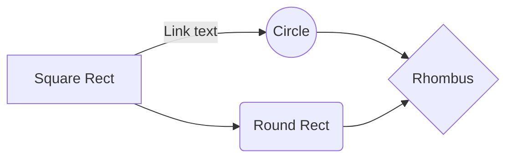

## A Mixed Integer programming solution to solve packing one bin
The enviroment is py3dbp python package
The LP solver is Pulp from Coin-OR

## Set up
pip install -r requirements.txt

## Disclaimer
This is a minimilastic approach, solving for one bin.  
TODO (): Formulate the problem, and find a way to scale to multi-binsi  
TODO (): Add support for rotation, Unloading priority and weight distribution  

## Green main
Running pytest in branch main should mark all tests as passed.

## TDD
Only TDD will be accepted to contribute to this repo  
I should see the Client code first.

## Meramaid-js
graph TD;
    A-->B;
    A-->C;
    B-->D;
    C-->D;

